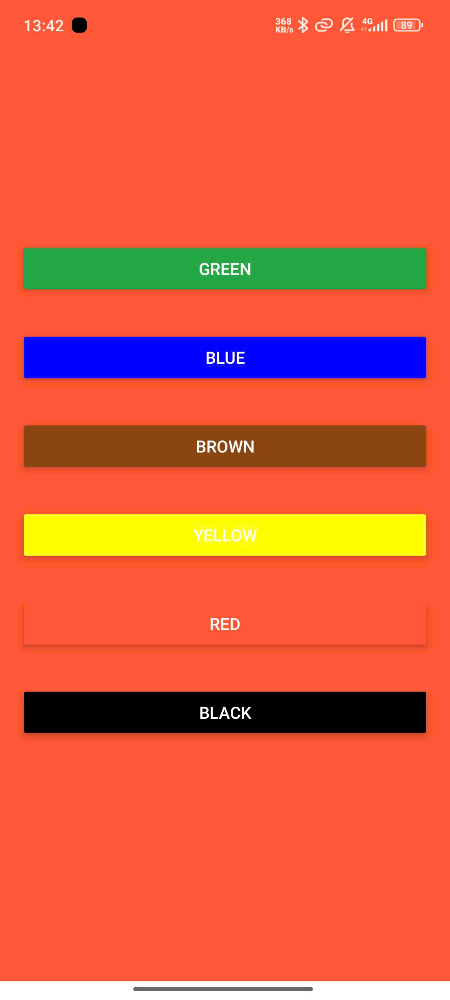
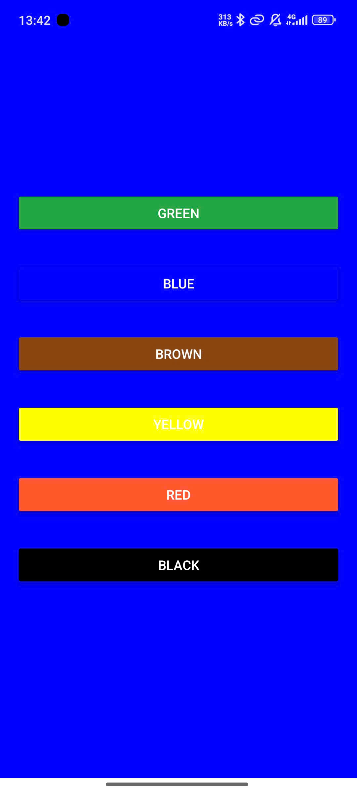
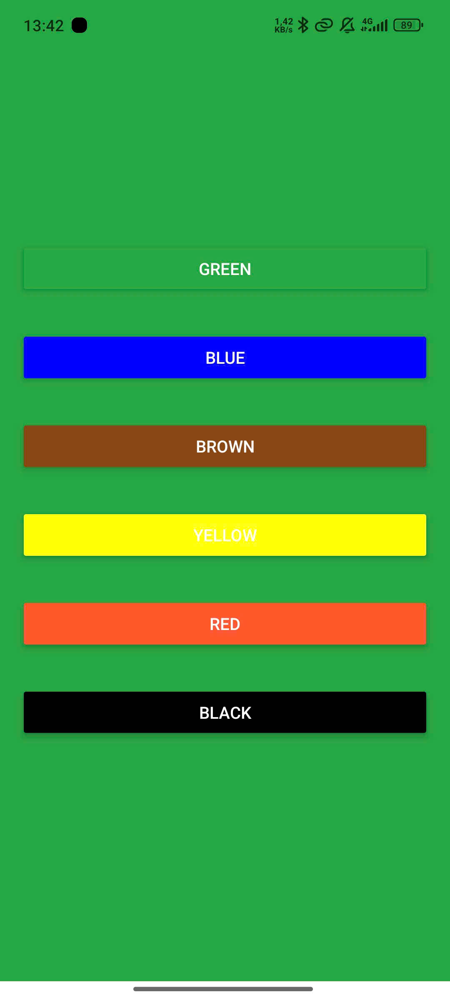

# Nguyễn Trọng Thịnh
### MSV: 20810310370
## Ket qua:
Bài tập 04:Validate form

bài tập cuối Slide buổi 05:

So sánh giữa FlatList và SectionList trong React Native:
1. Mục đích sử dụng:
FlatList:

Dùng để hiển thị danh sách các phần tử phẳng, không có phân nhóm.
Thích hợp cho các danh sách đơn giản, như danh sách sản phẩm, danh bạ, hoặc danh sách bài viết.
SectionList:

Dùng để hiển thị danh sách được phân thành các nhóm (sections).
Mỗi nhóm có thể có tiêu đề riêng (header) và các mục liên quan.
Thích hợp cho dữ liệu phân cấp, ví dụ: danh bạ phân nhóm theo chữ cái, lịch trình theo ngày.
2. Cấu trúc dữ liệu:
FlatList:

Nhận một mảng đơn giản.
javascript
Sao chép mã
const data = [
  { id: '1', title: 'Item 1' },
  { id: '2', title: 'Item 2' },
  { id: '3', title: 'Item 3' },
];
SectionList:

Nhận một mảng chứa các đối tượng, trong đó mỗi đối tượng đại diện cho một nhóm (section).
javascript
Sao chép mã
const sections = [
  {
    title: 'Section 1',
    data: ['Item 1-1', 'Item 1-2', 'Item 1-3'],
  },
  {
    title: 'Section 2',
    data: ['Item 2-1', 'Item 2-2'],
  },
];
3. Hiệu năng:
FlatList:

Tối ưu hóa hiệu năng cho danh sách lớn nhờ cơ chế virtualization (chỉ render các item hiển thị trên màn hình).
Thích hợp hơn khi không cần hiển thị danh sách có phân nhóm.
SectionList:

Tương tự như FlatList, cũng được tối ưu hóa với virtualization.
Tuy nhiên, với cấu trúc dữ liệu phức tạp hơn (bao gồm headers và nhiều sections), việc quản lý có thể tiêu tốn thêm bộ nhớ.
Hiệu năng giảm nhẹ khi số lượng sections và headers rất lớn.
4. Tính dễ sử dụng:
FlatList:

Đơn giản hơn, dễ sử dụng khi làm việc với danh sách không phân nhóm.
Cấu hình ít phức tạp hơn.
SectionList:

Đòi hỏi cấu trúc dữ liệu phức tạp hơn, phải cấu hình thêm các header và sections.
Cần thêm logic để xử lý các nhóm và hiển thị headers, nhưng cung cấp nhiều tùy chỉnh hơn cho giao diện phân cấp.
Khi nào nên dùng:
FlatList: Dùng khi bạn chỉ cần hiển thị danh sách phẳng, không có tiêu đề hoặc nhóm.
SectionList: Dùng khi bạn cần phân loại dữ liệu thành các nhóm có tiêu đề rõ ràng, như mục lục, lịch trình hoặc danh bạ.

